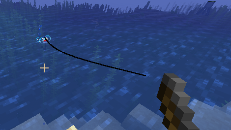
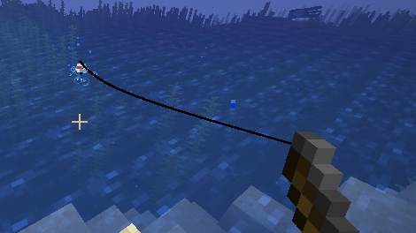

# Fishing Rod fix

This mod fixes fishing line rendering bugs in first-person and third-person view.

### Fixed bugs
- [MC-6579](https://bugs.mojang.com/browse/MC-6579) — Fishing line ignores FOV modifiers
- [MC-253540](https://bugs.mojang.com/browse/MC-253540) — The fishing line is offset from the fishing rod on aspect ratios other than 16:9
- [MC-148088](https://bugs.mojang.com/browse/MC-148088) — Fishing line doesn't adjust to the player's sneaking animation
- [MC-109884](https://bugs.mojang.com/browse/MC-109884) — While the player is moving, the fishing line isn't connected to a fixed spot on the rod
- [MC-116379](https://bugs.mojang.com/browse/MC-116379) — Punching with a cast fishing rod in the off-hand detaches the fishing line from the rod
- [MC-190324](https://bugs.mojang.com/browse/MC-190324) — Fishing line renders incorrectly when casting and retrieving a fishing rod in the left hand
- [MC-211561](https://bugs.mojang.com/browse/MC-211561) — Fishing line appears in the opposite hand when switching slots
- [MC-310980](https://bugs.mojang.com/browse/MC-310980) — The fishing line does not immediately disappear after switching from a fishing rod to another item
- [MC-4490](https://bugs.mojang.com/browse/MC-4490) — Fishing line not attached to fishing rod in third person while crouching
- [MC-176514](https://bugs.mojang.com/browse/MC-176514) — Fishing rod's rope doesn't render correctly when riding entities (third person mode)
- [MC-198777](https://bugs.mojang.com/browse/MC-198777) — Fishing line doesn't connect to fishing rod correctly while in a boat and in third person view
- [MC-247425](https://bugs.mojang.com/browse/MC-247425) — Fishing lines don't follow the movement of arms in third person
- [MC-270173](https://bugs.mojang.com/browse/MC-270173) — Fishing rod line positioned incorrectly in third-person while crawling/swimming
- [MC-270174](https://bugs.mojang.com/browse/MC-270174) — Fishing rod line positioned incorrectly in all view perspectives while sleeping

### Incompatible mods
- [Enchanted Fishing Line](https://modrinth.com/mod/enchanted-fishing-line): it carries its own copy of an older version of this fix, which would apply on top of this one. The game won't start with both installed.

### Before:

### After:

